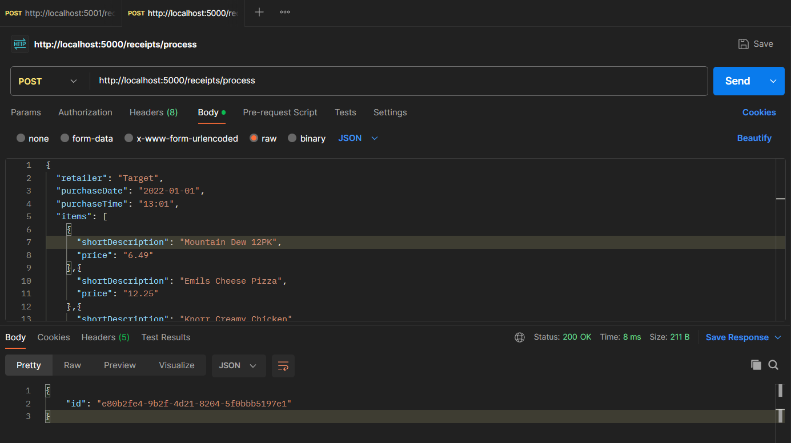
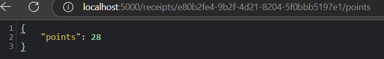

# Receipt Points Calculator

This service calculates points based on receipt data provided by users. Points are awarded based on retailer name, total amount, items, purchase date, and purchase time.

## Features

- Process receipts and generate unique IDs
- Retrieve points based on receipt data

### Prerequisites

- Python 3.9+
- Flask

### Setup Instructions and Running

1. Clone the repository:
    ```bash
    git clone https://github.com/VickyKarkera/Receipt-Processor-App.git
    ```
2. Navigate to correct folder:
    ```bash
    cd Receipt-Processor-App
    ```

3. Build Docker image:
    ```bash
    docker build . -t receipt-app
    ```

4. Run FLask App in Docker Container forwarded to port 5000, two ways:

    1. The below option can be terminated from the same terminal using CTRL + C keys
     ```bash
    docker run -it -p 5000:5000 receipt-app
    ```

    OR

    2. The below options image can be terminated using docker app
    ```bash
    docker run -d -p 5000:5000 receipt-app
    ```

5. Use POSTMAN (https://www.postman.com/) or curl for testing the microservice. In my implementation I will explain the POSTMAN method.

    Make a POST request in two ways:
    
    1. Paste receipt data in JSON format into the Body Tab and select the raw button and choose the input type to be JSON.
    2. Send a file by selecting the Body button followed by the binary option, to select a receipt JSON file to be uploaded.

6. Put the url for the request as http://localhost:5000/receipts/process and hit send. This will generate a unique random id.

 

7. Copy the id and insert it in place of the placeholder ( {id} ) within the link - http://localhost:5000/receipts/{id}/points and open it in the browser.
   



Note: The application will start on either: http://127.0.0.1:5000/receipts/{id}/points or http://localhost:5000/receipts/{id}/points .

## API Endpoints

### Process Receipt

- **URL:** `/receipts/process`
- **Method:** `POST`
- **Request Body:** JSON containing receipt data with fields: `retailer`, `total`, `items`, `purchaseDate`, `purchaseTime`.
- **Response:** JSON with `id` (unique receipt ID).

### Get Points

- **URL:** `/receipts/<receipt_id>/points`
- **Method:** `GET`
- **Response:** JSON with `points` (total points for the receipt).

## Testing

To test, use the provided sample data, or customize receipts to validate each points rule.
